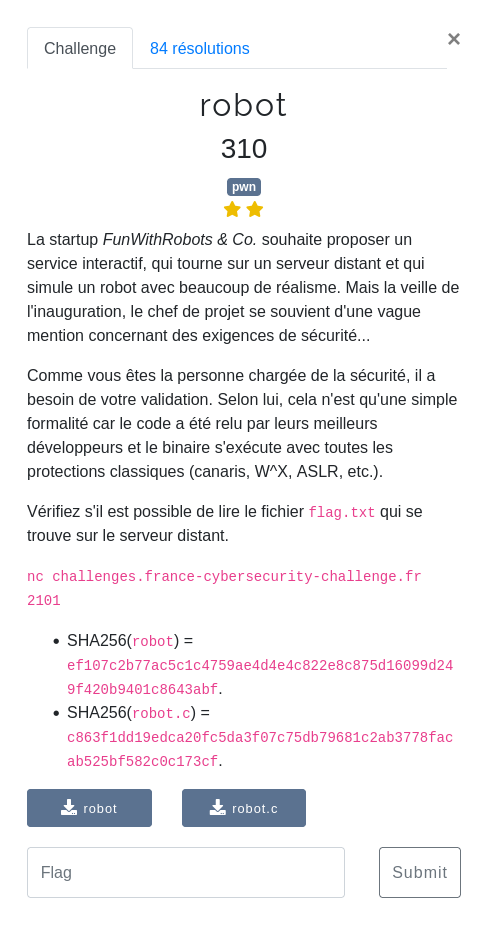

### Pwn / Robot

<p align="center">
  
</p>

Le binaire et le code source du challenge nous sont fourni :
- [robot](files/robot)
- [robot.c](files/robot.c)


Il suffit de regarder le code source pour comprendre qu'il s'agira d'exploiter une mauvaise utilisation de l'allocateur de mémoire avec un heap overflow.

Il y'a pas mal de WU sur ce genre de challenges, je ne vais pas trop détailler ici.


#### Fonctionnalités intéressantes

Dans le code un fonction que l'on a envie d'appeler :

```c
void admin(char *pwd){
    unsigned char hash[SHA256_DIGEST_LENGTH];
    char    result[65];

    SHA256((const unsigned char *) pwd, strlen(pwd), hash);

    for (int i = 0; i < SHA256_DIGEST_LENGTH; i++) {
        sprintf(result + (i * 2), "%02x", hash[i]);
    }

    if (strcmp(result, encrypted) == 0) {
        execl("/bin/cat", "/bin/cat", "flag.txt", NULL);
        perror("execl");
        exit(2);
    } else {
        puts("ERROR: wrong password!");
    }
}
```

Bien sur nous ne connaissons pas le mot de passe, mais nous pourrons essayer de sauter directement dans le code à l'addresse du `execl("/bin/cat", "/bin/cat", "flag.txt", NULL);`

Les deux structures dont nous allons pouvoir demander les créations avec l'allocation de mémoire :
```c
struct Robot {
    char name[16];
    void (*makeNoise)();
    void (*move)();
};

struct RobotUserGuide {
    char guide[32];
};
```

On remarque dans le `main`
```c
struct Robot  *robot = NULL;
struct RobotUserGuide *userGuide = NULL;
```

Nous aurons juste deux pointeurs vers un robot et vers un mode d'emploi, c'est à dire que si nous créons plusieurs robots, plusieurs structures seront créées dans la heap, mais seul le dernier sera "utilisé".

#### Exploitation

L'idée pour exploiter le binaire est :

- construire 2 robots
- jouer avec le dernier (= le détruire)
- créer un mode d'emploi (comme l'emplacement précédemment libéré n'est pas remis à zéro une partie de la structure du robot sera toujours présente)
- afficher le mode d'emploi (cela fera leaker les adresses de `makeNoise` et `roll` de la structure `Robot` écrasée)
- construire un robot
- jouer avec le dernier (= le détruire)
- continuer d'écrire le mode d'emploi (va écraser la structure du dernier robot en remplaçant les adresses des fonctions par celle qui nous intéresse)
- jouer avec le robot (bien que détruit, le pointeur `*robot`n'a pas été remis à NULL et pointe toujours vers notre robot)

Le code complet : [exploit.py](files/exploit.py)


```bash
$ python3 exploit.py REMOTE
[*] '/home/maskott/ctf/fcsc_2023/pwn/robot/robot'
    Arch:     amd64-64-little
    RELRO:    Full RELRO
    Stack:    Canary found
    NX:       NX enabled
    PIE:      PIE enabled
[+] Opening connection to challenges.france-cybersecurity-challenge.fr on port 2101: Done
[*] Menu
[*] Construire
[*] Construire
[*] Jouer
[*] Rediger
[*] Afficher
[*] Leak cat pass : 0x2a00970747c
[*] Construire
[*] Jouer
[*] Rediger
[*] Jouer
b'FCSC{136e057aa66dd6d6b772cae51260121f65973ff2045ec812ad597c9060a6a18d}\n'
[*] Closed connection to challenges.france-cybersecurity-challenge.fr port 2101
```
