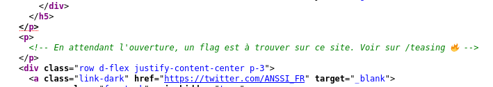
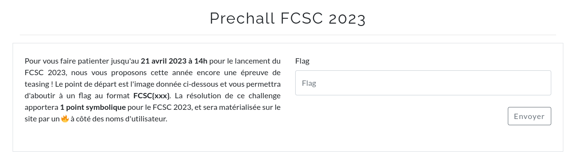
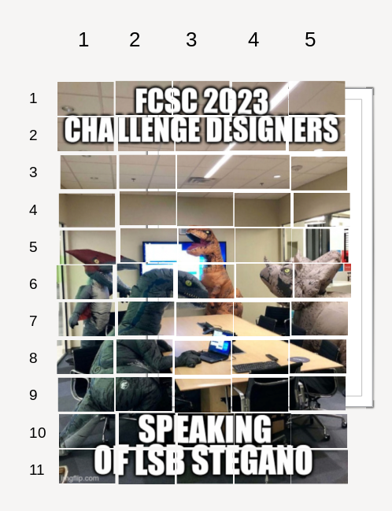
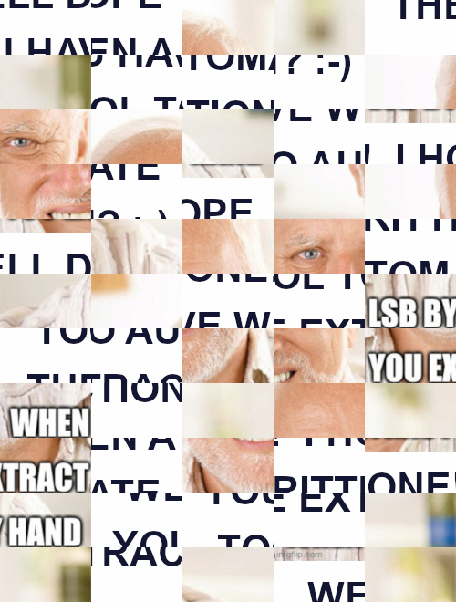
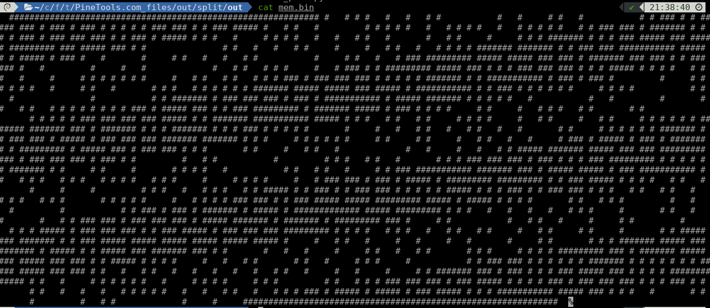

### Teaser / Challenge pré-CTF

Un challenge est caché sur le site avant l'ouverture du CTF

En regardant le code source du site du CTF : https://france-cybersecurity-challenge.fr/

<p align="center">
  
</p>

Il faut donc se rendre sur https://france-cybersecurity-challenge.fr/teasing

#### Step 1

<p align="center">
  
</p>

Et en plus des consignes, on récupère une image :

<p align="center">
  
</p>

D'une part il semble que nous allons devoir reconstituer l'image d'origine comme un puzzle, d'autre part en regardant un peu plus près ([Aperisolve](https://www.aperisolve.com/)) on remarque que les "sous images" produites par l'extraction des LSB contiennent des carrés entièrement noirs et des carrés de neige. Il faudra donc sûrement extraire des données des LSB.

Pour la décomposition : [Split](https://pinetools.com/split-image)

Permet de découper notre image en 11x5 pour récupérer 55 petits carrés, avant de les replacer :

<p align="center">
  
</p>

Ensuite nous pouvons numéroter les carrés originaux en **ligne-colonne.png**

<p align="center">
  
</p>

Et ré assembler l'image grâce à un petit script, qui fusionnes images d'une même ligne puis toutes les lignes entre elles :

```bash
#!/bin/bash

mkdir out

convert +append 1-{1..5}.png out/out-1.png
convert +append 2-{1..5}.png out/out-2.png
convert +append 3-{1..5}.png out/out-3.png
convert +append 4-{1..5}.png out/out-4.png
convert +append 5-{1..5}.png out/out-5.png
convert +append 6-{1..5}.png out/out-6.png
convert +append 7-{1..5}.png out/out-7.png
convert +append 8-{1..5}.png out/out-8.png
convert +append 9-{1..5}.png out/out-9.png
convert +append 10-{1..5}.png out/out-10.png
convert +append 11-{1..5}.png out/out-11.png


convert -append out/out-{1..11}.png out/recompose.png
```

Enfin nous pouvons extraire la donnée cachée dans les bits de poids faible de cette image.

Avec [CyberChef](https://gchq.github.io/CyberChef/), en ajoutant la brique **Extract LSB** et en choisissant les trois canaux RGB nous récupérons une nouvelle image.

#### Step 2

<p align="center">
  
</p>

Je ne sais pas si c'est voulu ou pas par les concepteurs du challenge, mais j'ai une barre noire en bas de l'image qui créé un décalage si on là découpe comme précédemment. Du coup, je passe dans Gimp pour recadrer l'image :

<p align="center">
  
</p>

Et on recommence. Pour faciliter le puzzle, en cherchant `old white man meme` sur son moteur favoris on retrouve rapidement un modèle.

#### Step 3

Cette fois l'extraction nous procure un binaire

[teaser](files/extracted.elf)

On peut faire quelques tests dessus, mais finalement ce ne sera pas un challenge de pwn :)


```c

undefined8 main(void)

{
  bool bVar1;
  size_t len;
  long cpt;
  long *maze_address;
  char user_input [256];
  long maze [512];
  int k;
  int horiz;
  int vert;
  int j;
  int i;

// initialise une zone mémoire à 0

maze_address = maze;
for (cpt = 0x200; cpt != 0; cpt = cpt + -1) {
  *maze_address = 0;
  maze_address = maze_address + 1;
}

// replis la zone de # ou de ' ' selon les valeurs des données stockées à &DAT_00104060

for (i = 0; i < 0x3f; i = i + 1) {
  for (j = 0; j < 0x40; j = j + 1) {
    if ((*(ulong *)(&DAT_00104060 + (long)i * 8) >> ((byte)j & 0x3f) & 1) == 0) {
      *(undefined *)((long)maze + (long)j + (long)i * 0x40) = 0x20;
    }
    else {
      *(undefined *)((long)maze + (long)j + (long)i * 0x40) = 0x23;
    }
  }
}

vert = 0;
horiz = 0;
bVar1 = true;

// récupère l'entrée utilisateur

__isoc99_scanf("%188s",user_input);
len = strlen(user_input);
for (k = 0; k < (int)len; k = k + 1) {
  if (user_input[k] == 'L') {
    horiz = horiz + -1;
  }
  else if (user_input[k] == 'R') {
    horiz = horiz + 1;
  }
  else if (user_input[k] == 'U') {
    vert = vert + -1;
  }
  else if (user_input[k] == 'D') {
    vert = vert + 1;
  }

  if (*(char *)((long)maze + (long)horiz + (long)vert * 0x40) == '#') {
    bVar1 = false;
  }
  if (vert < 0) {
    bVar1 = false;
  }
  if (horiz < 0) {
    bVar1 = false;
  }
  if (0x3e < vert) {
    bVar1 = false;
  }
  if (0x3e < horiz) {
    bVar1 = false;
  }
}
if (((bVar1) && (vert == 0x3e)) && (horiz == 0x3e)) {
  puts("Congrats!! You can use the flag given by this command to validate the challenge:");
  printf("echo -n %s | sha256sum | awk \'{ print \"FCSC{\" $1 \"}\" }\'\n",user_input);
}
return 0;
}
```

Les valeurs attendues par le programme L(eft) R(ight) U(p) D(own) laisse déjà supposer de la suite.

La zone mémoire utilisée est sur la stack, ce qui va être pratique pour rapidement tomber dessus et la dumper.

On lance le programme dans gdb et on break après le chargement des données sur la stack :

```c
gdb-peda$ x/70gx $rsp
0x7fffffffcd90:	0x0000000000000000	0x0000000000000000
0x7fffffffcda0:	0x0000000000000000	0x0000000000000004
0x7fffffffcdb0:	0x00007fffffffd150	0x00007ffff7fd9f58
0x7fffffffcdc0:	0x0000000000000000	0x0000000000022000
0x7fffffffcdd0:	0x0000000000021488	0x0000000000021488
0x7fffffffcde0:	0x0000000000000000	0x0000000000000001
0x7fffffffcdf0:	0x0000000000022000	0x000000000017c000
0x7fffffffce00:	0x000000000017beac	0x000000000017beac
0x7fffffffce10:	0x0000000000022000	0x0000000000000005
0x7fffffffce20:	0x000000000017c000	0x00000000001cb000
0x7fffffffce30:	0x00000000001ca4d4	0x00000000001ca4d4
0x7fffffffce40:	0x000000000017c000	0x0000000000000001
0x7fffffffce50:	0x00000000001cb000	0x00000000001d1000
0x7fffffffce60:	0x00000000001d07a0	0x00000000001d4680
0x7fffffffce70:	0x00000000001ca000	0x0000000000000003
0x7fffffffce80:	0x0000000000000000	0x0000000000000000
0x7fffffffce90:	0x2323232323232020	0x2323232323232323
0x7fffffffcea0:	0x2323232323232323	0x2323232323232323
0x7fffffffceb0:	0x2323232323232323	0x2323232323232323
0x7fffffffcec0:	0x2323232323232323	0x2023232323232323
0x7fffffffced0:	0x2023202320202023	0x2020202320202023
0x7fffffffcee0:	0x2023202320202023	0x2020202020202020
0x7fffffffcef0:	0x2023202020232020	0x2023202320202020
0x7fffffffcf00:	0x2020202020232020	0x2023202020202020
0x7fffffffcf10:	0x2023202323232023	0x2023232323232023
0x7fffffffcf20:	0x2323202320232323	0x2023232320232023
0x7fffffffcf30:	0x2023202320232023	0x2323202323232023
0x7fffffffcf40:	0x2323202320232023	0x2023232323232023
0x7fffffffcf50:	0x2023202320202023	0x2020202020232020
0x7fffffffcf60:	0x2023202320202020	0x2020202320232023
0x7fffffffcf70:	0x2023202320202023	0x2023202020232023
0x7fffffffcf80:	0x2023202320232020	0x2023202020232023
0x7fffffffcf90:	0x2323202323232023	0x2323232320232023
0x7fffffffcfa0:	0x2023202320232323	0x2023232320232023
0x7fffffffcfb0:	0x2323202323232023	0x2023202323232023
```

La succession de `0x23` et `0x20` sont les `#` et les `' '`

On peut alors dumper la zone considérée.

<p align="center">
  
</p>

On remet le tout en forme :

```python
mem = open("mem.bin","r").read()
of = open("maze.txt","w")

k = 0

for i in range(0x3f):
    for j in range(0x40):
        of.write(mem[k])
        k+=1
    of.write('\n')
```
```
S #############################################################
#   # # #   #   #   # #           #   #     # #   #           #
# ### # # ##### ### # ### # ### # # # # # ### ### # # ### #####
#   # #   #         # # # # #   #   # # # #   #   # # # # #   #
# ### ### # ####### # # # # ### # ### ### ### # # ### # ##### #
# #   #     # # # #   #   #   # #   #       #   # #     #     #
# # ####### # # # ### ##### ### ##### ######### ### ##### ### #
#               # #   #   #   # #     #     #   # #   #   # # #
# ####### ####### # # ### ### ########### ##### # # ##### # ###
#   #       #     # #   #   #   # #           #     # #   #   #
### ######### ##### ##### ### ### # ####### ### ### # # ### ###
#   #         #     #   #             #   # #   # # #     #   #
### # # ######### ##### ### # # # ### ### ### # # # ##### # # #
#   # # #   #     #     # # # # # # #     #   # #   # #   # # #
### # ### ### ### # # # # # ####### # # ########### # ### # ###
#         #     # # # # # #   #     # #   #       # # #   # # #
# # # ####### ##### ##### ### ##### # ########### # # ### # # #
# # #     # # # #           # #   #               #           #
# ####### # ### ### ### # ### # ########### # ##### ####### # #
# # #   #           #   #         #       # #   # #   # # # # #
# # # ### # ##### ### # # ### ######### # ####### ##### # ### #
# # #     # #     #   # # #   # #       # #                   #
# # # # ### ### ### ### ##### # # ####### ########### ##### # #
#   # #   # #     # # # #     #   # #     #   # #     # # # # #
# ####### ####### ### # ####### # # # ####### # # # ### # # # #
#       #     #   #   # #   #   # #   #   #       # #     # # #
# # # ####### # # ### ### # ##### # ### ### ### ####### #######
# # #     # # # # # #     # #     # #     #   # #   #   #     #
### # ##### # ### # ####### # # ######### # ##### ### # ### ###
# # #       # #     #   # #   #             #   #     #   #   #
# ##### ####### ##### ### ### ######### ### # ### ### ### # ###
# #         #   # #           #         # # #   # #   #       #
# # ### ### ### # ### # # # ### ######### # # # # # # ####### #
#     # #     #       # # # #   #           # #   # #   #     #
# ### ########### ####### ### # ##### ##### # ### ########### #
#   # # #   # # #   # # # #   # # #     #     # # # #     #   #
### ### # ### # ##### # ######### ######### # # ### ##### # # #
#   # #   #       #     #     #         # # #   #   # # #   # #
##### # # ### # # ### ### # # # # # ##### # # # ### # # ### ###
# # #   # #   # #   #   # # #   # # #       # # # # #     #   #
# # # ### ### # # ### ##### ##### ######### ##### # ##### # # #
#       # #   # # #         #   #     #         #           # #
### # ### # ####### # ##### # ############# ##### ######### # #
#   #   #   #   #   # # #     #       # #   #   #       #   # #
### ### # ### ### ### # ##### ####### # ####### # ######### ###
#     # #           #   # #   #     #     # #         #       #
# # ##### # ### ### ### # # ### ##### # ### ### ### ######### #
# # #   # # #   #   # #   # #     #   # #     # #     #       #
# ##### ### ####### # # ### ##### ##### ##### ##### ##### #####
#     #   # #   #     #   #     #   #       #     # #       # #
# ####### ##### ### ####### # ##### # # ##### ### ####### ### #
#       #   #   #     #     # #   #   # #       # # #     # # #
# ######### ### # ####### ##### ### ##### ### ### # # ##### # #
# #     #   #   # #       # #   #     # # #     #           # #
### ### # # # # # # ####### # # # # # # # ##### ##### ### ### #
#   #   # #   #   #   #   #   #   # #   #     #   #     #     #
# ####### ### # ### # # # ### ##### ### # # # # ############# #
#   #     # # # # # #   #     # # # #     # # #         # #   #
# # ### ### ### # ### ##### # # # # ### # ### ### ### # # # ###
# #       # #   #   #   #   # # # # #   #   #   # #   #   # # #
### # ##### # ##### # ### ##### # # # ########### ##### ### # #
#   #       # #       #         #   # #             #     #   E  
##############################################################
```

Le **E** et le **S**, sont rajoutée comme Start et Exit du labyrinthe pour la suite.

Maintenant il s'agit de résoudre le labyrinthe, la succession de direction pour arriver étant l'entrée attendue par le programme pour donner le flag.

Heureusement, c'est un jeu classique en programmation et on trouve facilement sur internet des scripts de résolution de labyrinthes.

Par exemple : [Solve](files/maze_solve.py)

(Qui nécessite l'ajout de E et S)

La sortie est la suivante :

```
..#############################################################
#.xx#x#x#xxx#xxx#xxx#x#xxxxxxxxxxx#xxx#xxxxx#x#xxx#xxxxxxxxxxx#
#.###x#x#x#####x###x#x###x#x###x#x#x#x#x#x###x###x#x#x###x#####
#.xx#x#xxx#xxxxxxxxx#x#x#x#x#xxx#xxx#x#x#x#xxx#xxx#x#x#x#x#xxx#
#.###x###x#x#######x#x#x#x#x###x#x###x###x###x#x#x###x#x#####x#
#.#xxx#xxxxx#x#x#x#xxx#xxx#xxx#x#xxx#xxxxxxx#xxx#x#xxxxx#xxxxx#
#.#x#######x#x#x#x###x#####x###x#####x#########x###x#####x###x#
#.xxxxxxxxxxxxxx#x#xxx#xxx#xxx#x#xxxxx#xxxxx#xxx#x#xxx#xxx#x#x#
#.#######x#######x#x#x###x###x###########x#####x#x#x#####x#x###
#...#xxxxxxx#xxxxx#x#xxx#xxx#xxx#x#xxxxxxxxxxx#xxxxx#x#xxx#xxx#
###.#########x#####x#####x###x###x#x#######x###x###x#x#x###x###
#xx.#xxxxxxxxx#xxxxx#xxx#xxxxxxxxxxxxx#xxx#x#xxx#x#x#xxxxx#xxx#
###.#x#x#########x#####x###x#x#x#x###x###x###x#x#x#x#####x#x#x#
#xx.#x#x#xxx#xxxxx#xxxxx#x#x#x#x#x#x#xxxxx#xxx#x#xxx#x#xxx#x#x#
###.#x###x###x###x#x#x#x#x#x#######x#x#x###########x#x###x#x###
#  ...xxxx#xxxxx#x#x#x#x#x#xxx#xxxxx#x#xxx#xxxxxxx#x#x#xxx#x#x#
# # #.#######x#####x#####x###x#####x#x###########x#x#x###x#x#x#
# # #.....# #x# #xxxxxxxxxxx#x#xxx#xxxxxxxxxxxxxxx#xxxxxxxxxxx#
# #######.# ### ###x###x#x###x#x###########x#x#####x#######x#x#
# # #   #.........xx#xxx#xxxxxxxxx#xxxxxxx#x#xxx#x#xxx#x#x#x#x#
# # # ### # #####.###x#x#x###x#########x#x#######x#####x#x###x#
# # #     # #xx...#xxx#x#x#xxx#x#xxxxxxx#x#xxxxxxxxxxxxxxxxxxx#
# # # # ### ###.###x###x#####x#x#x#######x###########x#####x#x#
#   # #   # #  ...#x# #x#xxxxx#xxx#x#xxxxx#xxx#x#xxxxx#x#x#x#x#
# ####### #######.### #x#######x#x#x#x#######x#x#x#x###x#x#x#x#
#       #     #xx.#   #x#   #xxx#x#xxx#   #xxxxxxx#x#xxxxx#x#x#
# # # ####### #x#.### ### # #####x#x### ###x###x#######x#######
# # #     # # #x#.#x#     # #...xx#x#     #xxx#x#   #...#     #
### # ##### # ###.#x####### #.#.######### #x##### ###.#.### ###
# # #       # #...xx#   # #  .#.............#   #.....#...#   #
# ##### #######.##### ### ###.######### ###.# ###.### ###.# ###
# #         #xx.# #  .........#         #x#.#...#.#   #  .....#
# # ### ### ###.# ###.# # # ### #########x#.#.#.#.# # #######.#
#     # #     #.......# # # #   #xxxxxxxxxx.#.#...# #   #xxxx.#
# ### ########### ####### ### # #####x#####.#.### ###########.#
#   # # #   # # #   # # # #   # # #xxxxx#  ...# # #x#xxxxx#...#
### ### # ### # ##### # ######### ######### # # ###x#####x#.# #
#   # #   #       #     #     #         # # #   #xxx#x#x#xx.# #
##### # # ### # # ### ### # # # # # ##### # # # ###x#x#x###.###
# # #   # #   # #   #   # # #   # # #       # # #x#x#xxxxx#.xx#
# # # ### ### # # ### ##### ##### ######### #####x#x#####x#.#x#
#       # #   # # #         #   #     #         #xxxxxxxxxx.#x#
### # ### # ####### # ##### # ############# #####x#########.#x#
#   #   #   #   #   # # #     #       # #   #xxx#xxxxxxx#xx.#x#
### ### # ### ### ### # ##### ####### # #######x#x#########.###
#     # #           #   # #   #     #     # #xxxxxxxxx#    ...#
# # ##### # ### ### ### # # ### ##### # ### ###x###x#########.#
# # #   # # #   #   # #   # #     #   # #     #x#xxxxx#xx.....#
# ##### ### ####### # # ### ##### ##### ##### #####x#####.#####
#     #   # #   #     #   #     #   #       #     #x#xxxx.xx#x#
# ####### ##### ### ####### # ##### # # ##### ### #######.###x#
#       #   #   #     #     # #   #   # #       # # #.....#x#x#
# ######### ### # ####### ##### ### ##### ### ### # #.#####x#x#
# #     #   #   # #       # #   #     # # #     #    .....xx#x#
### ### # # # # # # ####### # # # # # # # ##### ##### ###.###x#
#   #   # #   #   #   #   #   #   # #   #     #   #     #.....#
# ####### ### # ### # # # ### ##### ### # # # # #############.#
#   #     # # # # # #   #     # # # #     # # #         # #...#
# # ### ### ### # ### ##### # # # # ### # ### ### ### # # #.###
# #       # #   #   #   #   # # # # #   #   #   # #   #   #.# #
### # ##### # ##### # ### ##### # # # ########### ##### ###.# #
#   #       # #       #         #   # #             #     #...E  
##############################################################
```

Le chemin tracé par les `.` est celui à fournir au programme (avec un D final pour sortir)

```python
def slurp(mazefile):
    infile = open(mazefile, 'r')
    maze = [list(row) for row in infile.read().splitlines()]
    infile.close()

    return maze

maze = slurp("maze_solved.txt")
x=0
y=0
path = ''

while maze[y][x] != 'E':
    maze[y][x] = 'o'
    if maze[y][x+1] in '.E':
        path += 'R'
        x=x+1
    elif maze[y][x-1] in '.E':
        path += 'L'
        x=x-1
    elif maze[y+1][x] in '.E':
        path += 'D'
        y=y+1
    elif maze[y-1][x] in '.E':
        path += 'U'
        y=y-1

print(path + 'D')
```
```bash
$ python3 retrive_path.py | ./extracted.elf
Congrats!! You can use the flag given by this command to validate the challenge:
echo -n RDDDDDDDDDRRDDDDDDRRDDRRRRDDRRRRRRRRDDLLDDRRDDDDDDLLDDDDRRRRRRUURRRRRRRRUUUURRDDRRRRRRRRRRRRDDDDDDRRUUUURRDDRRUUUURRRRUURRDDRRDDRRRRDDDDLLDDDDDDDDDDRRDDLLLLDDDDLLLLDDRRRRDDRRRRDDLLDDDDRRRD | sha256sum | awk '{ print "FCSC{" $1 "}" }'
```

`FCSC{5cf9940286533f76743984b95c8edede9dbfde6226de012b8fe84e15f2d35e83}`
